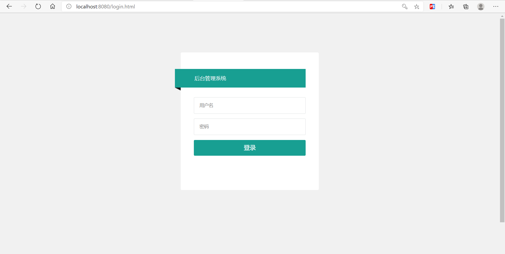
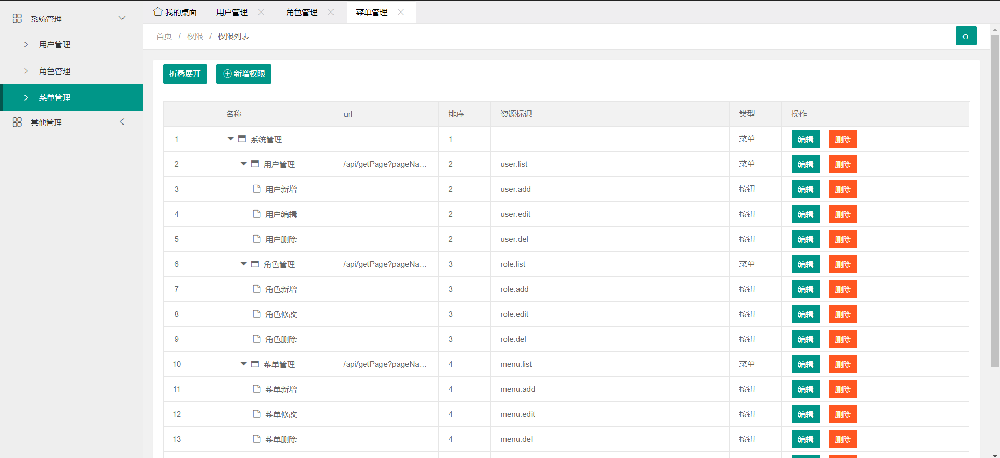
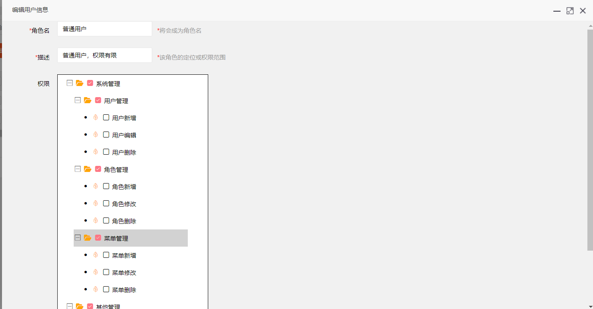
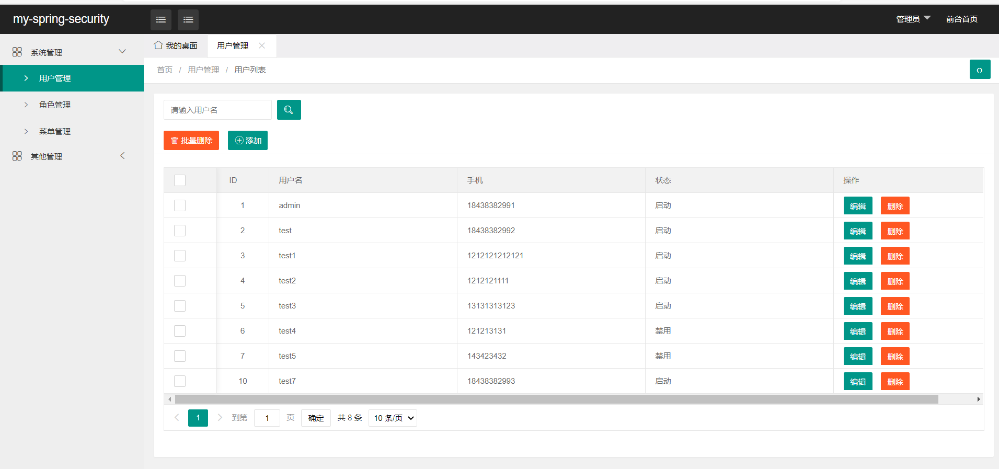
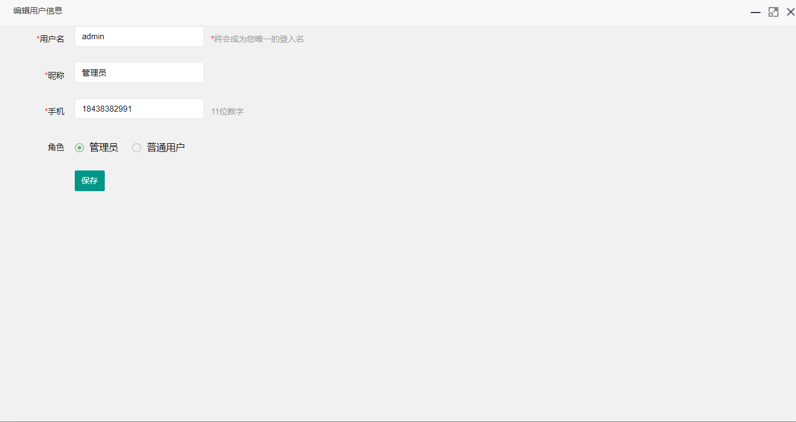
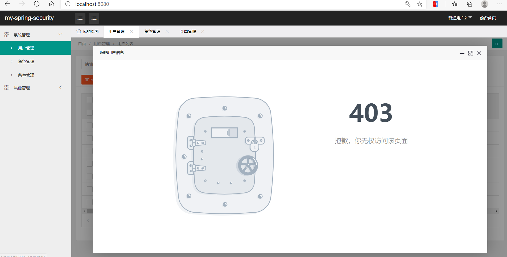

# my-springsecurity
#### 介绍
这是一款基于springsecurity的极简RBAC权限管理系统

#### 技术选型
1、springboot  
2、mybatis    
3、springsecurity  
4、mysql  
5、druid  
6、swagger  
7、ztree  
8、dtree  
9、xadmin

#### 快速使用

- 下载maven项目
 
- 导入idea
 
- 导入docs文件夹下sql文件到数据库
 
- 修改数据库配置文件的路径，用户名等信息
 
- 运行

#### 说明

1、 密码是基于BCryptPasswordEncoder（）加密,管理员账号密码admin，123456，其余如果名称是test1则密码是111111，依次类推
2、 本项目还有很多不完善的地方,比如接口的风格和类型，前后端逻辑也不是很全，不过仅仅是作为搞懂springsecurity的入门demo是完全足够了。  
3、 之后会重新开发一套springsecurity的系统，会集成上jwt、redis等。

#### 赞赏
如果您觉得本项目对您有帮助的话，请予以支持，您的支持就是我的动力。

| 支付宝 | 微信 |
| ------ | ---- |
|        |      |

 

